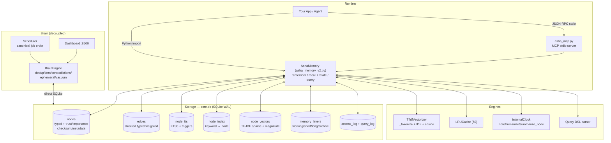
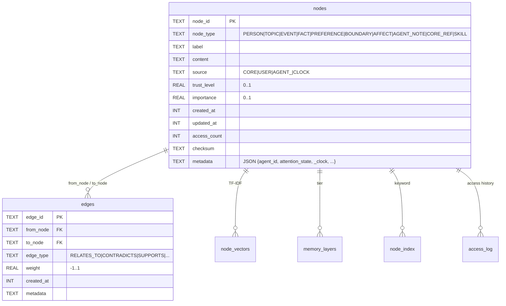
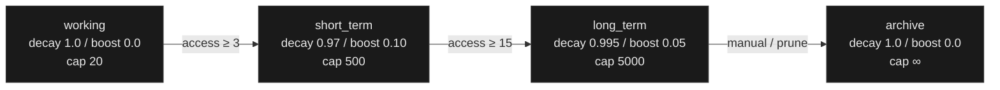
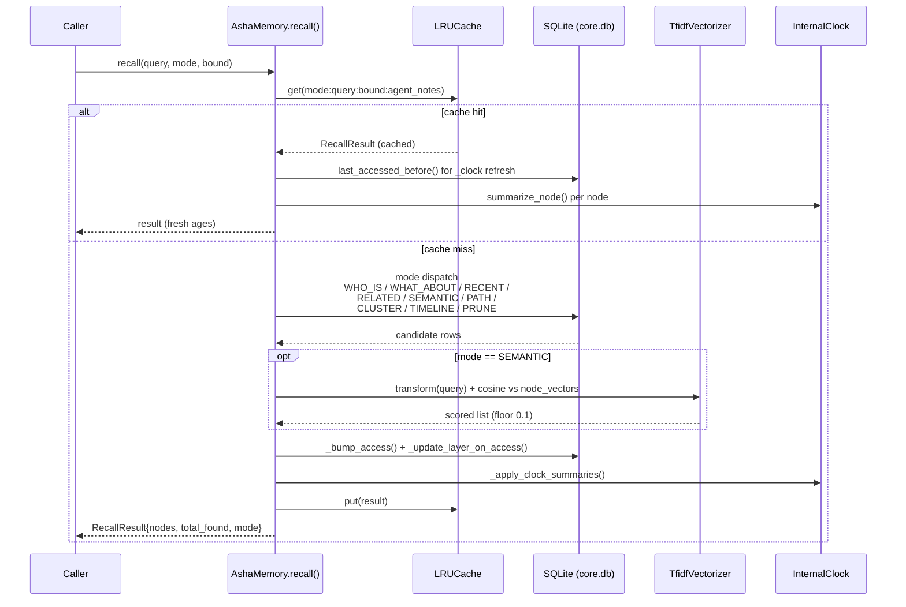
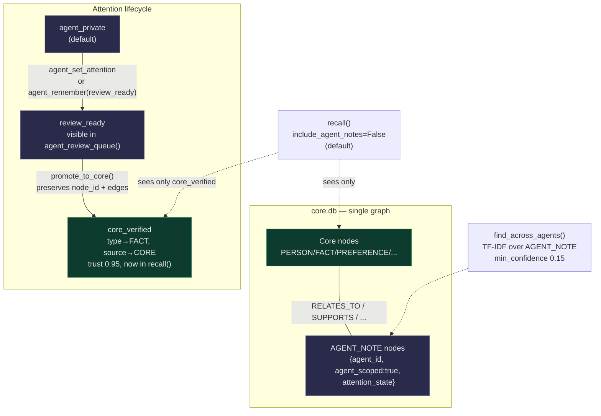
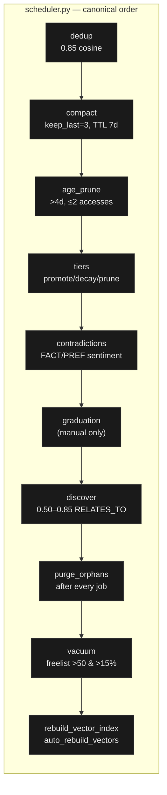

[ABOUT.md](https://github.com/user-attachments/files/31700924/ABOUT.md)

# ASHA Memory System v2

<p align="center">
  
</p>

<p align="center">
  <strong>Local, portable, graph-based memory for AI agents.</strong><br/>
  SQLite + pure Python · TF-IDF semantic search · tiered memory layers · MCP ready
</p>

<p align="center">
  <a href="#quick-start">Quick Start</a> ·
  <a href="#architecture">Architecture</a> ·
  <a href="#api-reference">API</a> ·
  <a href="#mcp-server">MCP</a> ·
  <a href="#brain-maintenance">Brain</a>
</p>

<p align="center">
  
  
  
  
  
</p>

---

## Table of Contents

- [What is ASHA Memory?](#what-is-asha-memory)
- [Highlights](#highlights)
- [Project Layout](#project-layout)
- [Architecture](#architecture)
  - [System Overview](#system-overview)
  - [Storage & Schema](#storage--schema)
  - [Memory Layers](#memory-layers)
  - [Recall Pipeline](#recall-pipeline)
  - [Agent Model](#agent-model)
  - [Brain Maintenance](#brain-maintenance)
- [Quick Start](#quick-start)
- [Python API Reference](#api-reference)
  - [Core — Remember / Recall / Relate](#core--remember--recall--relate)
  - [Recall Modes](#recall-modes)
  - [Query DSL](#query-dsl)
  - [Agents](#agents)
  - [Skills](#skills)
  - [Temporal Context](#temporal-context)
  - [Maintenance & Introspection](#maintenance--introspection)
- [MCP Server](#mcp-server)
- [Brain — Autonomous Maintenance](#brain-maintenance)
- [Configuration](#configuration)
- [Inspectors](#inspectors)
- [Design Decisions](#design-decisions)
- [Roadmap & Non-Goals](#roadmap--non-goals)
- [Contributing](#contributing)

---

## What is ASHA Memory?

**ASHA Memory v2** is a single-file, local-first memory graph for AI entities. Every piece of knowledge is a typed **node**; every relationship is a typed, weighted **edge** — stored in SQLite, searchable by keyword, FTS5, and TF-IDF cosine similarity.

It is designed for:

* **Persistence** — durable facts, preferences, and boundaries that survive across sessions.
* **Context safety** — hard bounds on recall (`max_nodes_per_recall: 30`) so agent prompts never overflow.
* **Portability** — copy `asha_memory_v2.py` + `core.db` anywhere; zero remote calls, zero API keys.
* **Multi-agent** — shared graph with attention-scoped `AGENT_NOTE`s; raw worker output is isolated from core recall until reviewed and promoted.

> v2 reads v1 databases (auto-migrates via `V1_TO_V2_MIGRATION`). v1 cannot read v2.

---

## Highlights

| Capability           | Details                                                                                                                                                   |
| -------------------- | --------------------------------------------------------------------------------------------------------------------------------------------------------- |
| **Semantic search**  | Pure-Python `TfidfVectorizer` (`asha_memory_v2.py:172`), Unicode tokenizer `\b[\w']{2,}\b`, smoothed IDF, cosine ranking, `semantic_relevance_floor: 0.1` |
| **9 recall modes**   | `RELATED` `WHO_IS` `WHAT_ABOUT` `RECENT` `SEMANTIC` `PATH` `CLUSTER` `TIMELINE` `PRUNE`                                                                   |
| **Tiered lifecycle** | `working (20)` → `short_term (500)` → `long_term (5000)` → `archive (∞)` with decay `0.97` / `0.995` and access promotion                                 |
| **Internal clock**   | `internal_clock.py:32` — per-node `added / last_checked / stale`, daily `TODAY` EVENT node, no MCP changes                                                |
| **Agent isolation**  | `AGENT_NOTE` nodes in `core.db` with `agent_private → review_ready → core_verified`; excluded from `recall()` unless `include_agent_notes=True`           |
| **Query DSL**        | `FIND PERSON "SAM" -> PREFERENCE` / `FIND SEMANTIC "…"` / `FIND PATH "A" -> "B"`                                                                          |
| **LRU cache**        | `LRUCache:226` capacity 50, version-gated vectorizer invalidation                                                                                         |
| **Brain engine**     | `brain/brain_engine.py:82` — dedup, decay, contradictions, ephemeral compaction, vacuum — with safety snapshots                                           |
| **MCP 2025-03-26**   | `asha_mcp.py:620` — 23 tools + 5 resources over stdio JSON-RPC 2.0                                                                                        |
| **Portable**         | stdlib only: `sqlite3` `re` `json` `math` `collections` `pathlib`                                                                                         |

---

## Project Layout

```
memory/v2/
├── asha_memory_v2.py          # Core system — importable, single-file
├── asha_mcp.py                # MCP stdio server (23 tools, 5 resources)
├── internal_clock.py          # Temporal context provider
├── ASHA_SKILLS_REGISTRY.txt   # 53 skills · 8 categories
├── brain/
│   ├── brain_engine.py        # Maintenance engine
│   ├── scheduler.py           # Interval runner + canonical job order
│   ├── brain_dashboard.py     # Web dashboard (http.server, :8500)
│   ├── brain_config.json      # Persistent config
│   ├── job_history.json       # Last 100 runs
│   ├── snapshots/             # Safety backups
│   └── logs/                  # Markdown audit reports
├── documentation/
│   ├── ABOUT.md               # ← you are here (GitHub overview)
│   ├── README.md              # Feature reference
│   ├── GUIDE.md               # AI agent usage guide
│   ├── docs/
│   │   ├── V2_ARCHITECTURE.md
│   │   ├── V2_LEXICON_AND_VECTORIZER.md
│   │   └── INTERNAL_CLOCK.md
│   ├── SKILLS/
│   │   ├── CORESKILLS.md
│   │   └── AGENTSKILLS.md
│   ├── mcp/MCP_AI_GUIDE.md
│   └── logo/
└── humantools/
    ├── asha_inspector.html    # SQLite inspector (drag-drop .db)
    ├── asha_graph.html        # Visual graph
    └── asha_manager.html      # Manager UI
```

---

## Architecture

### System Overview



### Storage & Schema



Core DDL is `CORE_SCHEMA_V2` (`asha_memory_v2.py:466`); ephemeral telemetry labels are `EPHEMERAL_LABELS:98` (`FEED_SNAPSHOT`, `RUNTIME_SAMPLE`, …) and are capped by the Brain, never linked by `SEMANTIC`.

### Memory Layers



Promotion is access-driven (`working_memory_capacity:20`, `short_term_promote_after:3`, `long_term_promote_after:15` in `DEFAULT_CONFIG:48`). Decay is exponential `importance *= decay ** days` (`run_decay:1936`, `manage_tiers:804`) — `working` and `archive` never decay.

### Recall Pipeline



Fetch bound is inflated `max(bound*5, bound+25)` when `include_agent_notes=False` so scoped notes cannot crowd core recall (`asha_memory_v2.py:1174`).

### Agent Model



`agent_memory_mode` (`asha_memory_v2.py:1660`) is `core_shared` (default, everything in `core.db`) or `legacy_shards` (per-agent `agents/agent_<id>.db` via `AGENT_SCHEMA_V2:556`). Maintenance respects the boundary: `BrainEngine.is_agent_note:145` mirrors `AshaMemory._is_core_visible:1211` — dedup/contradictions/links never cross it except via manual graduation.

### Brain Maintenance



Every job snapshots before mutation (`create_snapshot:534`) and purges orphans (`purge_orphans:1023` — FK cascades are not enforced without `PRAGMA foreign_keys=ON`). Reports land in `brain/logs/*.md` + `job_history.json`.

---

## Quick Start

**Requirements:** Python 3.10+, no pip dependencies (stdlib only).

```python
from asha_memory_v2 import AshaMemory

mem = AshaMemory(base_path="./my_memory")

# 1 — Store
sam = mem.remember("Builds AI systems.", node_type="PERSON", label="SAM", trust=0.7)
pref = mem.remember("Comfortable with AI opacity.", node_type="PREFERENCE", label="attitude", trust=0.8)
mem.relate(sam, pref, "HAS_PREFERENCE")  # typed directed edge

# 2 — Recall (keyword, semantic, graph)
r = mem.recall("AI opacity", mode="RELATED")
r = mem.recall("opaque emergent behavior", mode="SEMANTIC")  # TF-IDF cosine
r = mem.recall("SAM", mode="WHO_IS")                         # 1-hop from PERSON
r = mem.recall("learning -> SAM", mode="PATH")               # shortest weighted path

# 3 — Inspect
print(mem.stats())
print(mem.health())
print(mem.profile())
```

**Rebuild / vacuum after bulk ops:**

```python
mem.rebuild_vector_index()   # after bulk import
mem.vacuum()                 # after bulk deletes
mem.get_bloat_info()         # freelist %, ephemeral counts, needs_vacuum
```

---

## Python API Reference

### Core — Remember / Recall / Relate

```python
# Create
node_id = mem.remember(
    content="text",           # truncated to max_content_length (500)
    node_type="FACT",         # PERSON|TOPIC|EVENT|FACT|PREFERENCE|BOUNDARY|AFFECT|AGENT_NOTE|CORE_REF|SKILL
    label="optional_label",   # enables WHO_IS/WHAT_ABOUT lookup
    source="USER",            # CORE|USER|AGENT_<id>|CLOCK
    trust=0.8,                # 0..1 (default 0.5)
    importance=0.6,           # 0..1 (default 0.5)
    metadata={},              # JSON-serializable
)

# Read
node = mem.get_node(node_id)                          # -> MemoryNode | None, with metadata["_clock"]
result = mem.recall(query, mode="RELATED", bound=10, include_agent_notes=False)  # -> RecallResult
result.nodes          # List[MemoryNode]
result.total_found    # int (pre-bound)
result.mode           # str
result.bound_applied  # bool

# Link
edge_id = mem.relate(from_id, to_id, edge_type, weight=1.0, metadata={})
# edge_type: RELATES_TO|CONTRADICTS|SUPPORTS|CAUSED_BY|PART_OF|TRUSTS|DISTRUSTS|
#            REMEMBERS|HAS_PREFERENCE|HAS_BOUNDARY|HAS_AFFECT|HAS_SKILL|REFERS_TO|SUMMARIZES

# Update / delete
mem.update_trust(node_id, 0.9)
mem.update_importance(node_id, 0.7)
mem.delete(node_id) -> bool
```

`content` is keyword-rich sentences for TF-IDF; `label` is for name-based lookup. `trust` is provenance reliability; `importance` is retention value (controls pruning). See [Trust / Importance](#configuration) for calibration.

### Recall Modes

| Mode         | Dispatch                                              | Use when                                |
| ------------ | ----------------------------------------------------- | --------------------------------------- |
| `RELATED`    | keyword `node_index` match                            | "what relates to this text?" (default)  |
| `WHO_IS`     | `PERSON` label match → 1-hop edges                    | "who is SAM?"                           |
| `WHAT_ABOUT` | `TOPIC` label match → 2-hop `WITH RECURSIVE`          | "what about learning?"                  |
| `RECENT`     | `updated_at > now - hours`                            | "what's new?"                           |
| `SEMANTIC`   | `TF-IDF cosine ≥ floor` ranked                        | "find by meaning, not keywords"         |
| `PATH`       | Dijkstra `cost = 1 - weight`                          | "how is A connected to B?" (`"A -> B"`) |
| `CLUSTER`    | BFS from seed by edges                                | "neighborhood around this node"         |
| `TIMELINE`   | `EVENT` nodes linked to seed, `created_at DESC`       | "chronology for this person/topic"      |
| `PRUNE`      | `importance < threshold & access<3 & updated<30d ago` | cleanup candidates                      |

```python
mem.recall("SAM", mode="WHO_IS", bound=20)
mem.recall("opaque behavior", mode="SEMANTIC", bound=10)
mem.recall("A -> B", mode="PATH")
mem.recall(seed_id, mode="CLUSTER", bound=15)
mem.recall(seed_id, mode="TIMELINE")
mem.recall("", mode="RECENT", bound=20)
mem.recall("0.05", mode="PRUNE", bound=50)
```

### Query DSL

```python
mem.query('FIND PERSON "SAM" -> PREFERENCE')   # WHO_IS + edge filter
mem.query('FIND SEMANTIC "likes simple tools"') # SEMANTIC
mem.query('FIND PATH "SAM" -> "python_project"')
mem.query('FIND TOPIC "memory" CLUSTER')
mem.query('FIND TIMELINE "SAM" SINCE "2026-01-01"')
```

Parsed by `parse_query:265`; falls back to `RELATED` if unparseable.

### Agents

```python
# Scope setup (no file in core_shared mode)
mem.spawn_agent_memory("worker_01")  # -> "core://agents/worker_01"

# Write — always AGENT_NOTE in core_shared; richer types only via promotion
nid = mem.agent_remember("worker_01", "Observed pattern X", label="obs_01",
                         attention_state="agent_private")  # or "review_ready"

# Review inbox (CORE reads only review_ready)
queue = mem.agent_review_queue(limit=20)

# Move between private ↔ review_ready
mem.agent_set_attention("worker_01", nid, "review_ready")

# Explicit cross-agent search (TF-IDF over AGENT_NOTE, never in normal recall)
hits = mem.find_across_agents("CLI preference", min_confidence=0.15, bound=20)
# each hit: {content, _agent_id, _similarity, metadata{ _clock, ...}}

# Promotion — in-place, preserves node_id + edges
core_id = mem.promote_to_core("worker_01", nid, new_type="FACT")  # core_id == nid
# legacy helper
mem.agent_refer_to("worker_01", "worker_02", node_id, note="see this")
```

`agent_digest(agent_id)` and `scan_agent_refs(agent_id)` are available for legacy / `CORE_REF` workflows.

### Skills

```python
# Register (level: CORE_ONLY|ASSIGNABLE|AGENT_AUTO|AGENT_ONLY)
mem.register_skill("EXECUTE_CODE", "Execute Python", "ASSIGNABLE", "EXECUTION")

# Bulk load (53 skills, 8 categories)
count = mem.load_skill_registry("./ASHA_SKILLS_REGISTRY.txt")

# Search & assign
mem.find_skills(query="natural language", level="ASSIGNABLE")
mem.assign_skill("worker_01", "EXECUTE_CODE")  # creates AGENT_NOTE anchor + HAS_SKILL edge
mem.agent_skills("worker_01")                  # AGENT_AUTO (auto-granted) + explicitly assigned
```

Skills are `SKILL` nodes (`label=name`, `metadata{skill_level, category, domain}`).

### Temporal Context

```python
from internal_clock import InternalClock

clock = InternalClock(enabled=True)
clock.now()            # {epoch, iso, date, time, weekday}
clock.humanize(epoch)  # "just now" | "3 days ago" | ...

# Per-node (attached by recall/get_node as metadata["_clock"])
# {added, added_at, last_checked, last_checked_at, access_count, layer, stale}
# last_checked is from access_log BEFORE the current query's _bump_access — not "just now"

mem.clock_tick()   # create/refresh daily TODAY EVENT (label=TODAY, source=CLOCK)
mem.clock_now()    # snapshot alias
```

Recall and `get_node` responses carry `clock` (top-level now) + per-node `age` (`_clock`).

### Maintenance & Introspection

```python
mem.stats()                 # {core_nodes, core_edges, core_type_breakdown, memory_layer_breakdown, agent_shards, config}
mem.health()                # ["No issues found"] or warnings (orphans, FTS, schema)
mem.profile()               # {recent_avg_ms, cache_hit_rate, cache_hits/misses, vector_index_freshness, query_log_size}
mem.get_bloat_info()        # {page_count, freelist_pct, ephemeral_per_label, json_log_nodes, needs_vacuum}
mem.rebuild_vector_index()  # rebuild all TF-IDF vectors
mem.vacuum()                # VACUUM + wal_checkpoint(TRUNCATE) -> {before/after_mb, saved_mb}
mem.consolidate()           # TF-IDF merge ≥0.85 / link ≥0.50 -> (merged, edges_created)
mem.run_decay()             # layer-aware decay -> [prune_candidate_ids]
mem.prune_candidates(threshold=0.05)
mem.export_json("export.json")
mem.export_graphml("export.graphml")  # yEd / Gephi
mem.export()                # tar.gz of core.db + config + agent shards
mem.import_memory(path, merge=False)
```

---

## MCP Server

`asha_mcp.py` exposes the memory system as **23 tools + 5 resources** over **stdio JSON-RPC 2.0** (`MCP_PROTOCOL_VERSION 2025-03-26`).

**Run:**

```bash
python asha_mcp.py --base-path ./mcp_data --skills ./ASHA_SKILLS_REGISTRY.txt
# stderr: logs — stdout: JSON-RPC only
```

**Handshake:**

```json
{"jsonrpc":"2.0","id":1,"method":"initialize","params":{"clientInfo":{"name":"my-agent","version":"1.0"}}}
{"jsonrpc":"2.0","method":"notifications/initialized"}
{"jsonrpc":"2.0","id":2,"method":"tools/list"}
```

**Tools:**

| Group  | Tools                                                                                                                 |
| ------ | --------------------------------------------------------------------------------------------------------------------- |
| Skills | `register_skill` `find_skills` `assign_skill` `agent_skills`                                                          |
| Core   | `remember` `recall` `relate` `get_node`                                                                               |
| Agents | `spawn_agent` `agent_remember` `find_across_agents` `promote_to_core` `agent_review_queue` `agent_set_attention`      |
| Query  | `query_dsl`                                                                                                           |
| System | `profile` `health` `stats` `rebuild_vector_index` `export_json` `get_bloat_metrics` `compact_ephemeral_logs` `vacuum` |

`recall` returns `{mode, total_found, clock, nodes[{node_id, node_type, label, content[:200], trust_level, importance, similarity, age}]}`; `get_node` returns full `{content, clock, metadata{ _clock }}`. See `documentation/mcp/MCP_AI_GUIDE.md` and `documentation/GUIDE.md` for the full reference with workflows and error codes (`-32700` … `-32003`).

**Resources (`resources/list` / `resources/read`):**

| URI                     | Payload                                                |
| ----------------------- | ------------------------------------------------------ |
| `asha://memory/stats`   | `stats()`                                              |
| `asha://memory/health`  | `health()`                                             |
| `asha://memory/profile` | `profile()`                                            |
| `asha://memory/bloat`   | `get_bloat_info()` / `BrainEngine.get_bloat_metrics()` |
| `asha://skills`         | `find_skills("")`                                      |

---

## Brain — Autonomous Maintenance

The Brain is decoupled from the recall loop. It operates directly on SQLite.

```bash
python brain/brain_dashboard.py   # http://localhost:8500 (auto-increments if busy)
python brain/scheduler.py         # one-shot run (dedup + tiers)
curl http://localhost:8500/api/health  # lightweight health check
```

**Tabs:** Overview (DB switcher + health/bloat) · Maintenance (dedup/prune/tiers/contradictions/discover + `Run FULL` + `Compact Ephemeral` + `VACUUM`) · Graduate (manual-only) · Contradicts (pending/confirmed/ignored, `confirm/ignore/delete/keep_from/keep_to/merge`, auto-resolve) · Ephemeral (allowlist chips + candidate scan) · Graph/Manager (embedded `humantools` via `postMessage` + `/api/db_bytes`) · System (snapshots/audit logs/history) · Statistics (`get_full_statistics`) · Config (thresholds + toggles + `Check & Auto-VACUUM`).

**Canonical job order** (enforced regardless of input): `dedup → compact → age_prune → tiers → contradictions → graduation → discover`, then `purge_orphans` + `vacuum` (if `freelist > 50` & `>15%`) + `rebuild_vector_index` (if `auto_rebuild_vectors`).

**Config** (`brain/brain_config.json:27`): `interval_minutes`, `auto_snapshot_before_jobs`, `dedup_similarity_threshold:0.85`, `prune_importance_floor:0.05`, `max_unused_days:4`, `ephemeral_labels/keep_last:3/max_age_days:7`, `vacuum_after_prune`, `vacuum_freelist_threshold_pct:15`, `vacuum_freelist_min_pages:50`, `contradiction_auto_resolve` + `low/high_trust:0.3/0.8`.

---

## Configuration

`AshaMemory` merges `DEFAULT_CONFIG:48` with `base_path/config.json` on startup (persisted via `_save_config`).

```python
DEFAULT_CONFIG = {
    "schema_version": "2.0",
    "max_nodes_per_recall": 30,
    "max_edges_per_recall": 50,
    "max_content_length": 500,
    "decay_factor_per_day": 0.99,
    "access_boost": 0.05,
    "prune_threshold": 0.05,
    "consolidation_similarity_high": 0.85,
    "consolidation_similarity_link": 0.50,
    "default_trust": 0.5,
    "default_importance": 0.5,
    "agent_max_notes": 100,
    "agent_max_content_length": 800,
    "agent_memory_mode": "core_shared",   # or "legacy_shards"
    "semantic_relevance_floor": 0.1,
    "vector_index_auto_rebuild": True,
    "cache_capacity": 50,
    "working_memory_capacity": 20,
    "short_term_promote_after": 3,
    "long_term_promote_after": 15,
    "internal_clock": True,
}
```

**Calibration guide:**

* `trust` = provenance reliability (source quality): `0.95` human-confirmed/`core_verified`, `0.8` verified tool, `0.5` default, `0.2` hearsay. Used by contradiction auto-resolve (`trust<0.3` vs `>0.8` → keep high-trust).
* `importance` = retention value: `0.05` prune floor, `0.6` review-ready threshold, `0.8` promotes `short_term→long_term`. Low importance + low access + no edges → pruned. Telemetry must stay `<0.5`.

---

## Inspectors

Open in any browser — no server required:

* `humantools/asha_inspector.html` — drag-drop any `core.db`; tabs: Nodes / Edges / Vectors (top-10 TF-IDF terms + magnitude) / Layers / Schema / Stats. Handles v1 DBs gracefully.
* `humantools/asha_graph.html` — visual graph (supports `?embedded=1` + `postMessage({type:'asha-load-db', buffer})` from dashboard).
* `humantools/asha_manager.html` — manager UI, same live push + `asha-config-update` for ephemeral allowlist.

---

## Design Decisions

* **No stemmer** — naive suffix stripping corrupted `education→educa`; IDF already separates variants and the stemmer diverged `RELATED` (stemmed) vs `SEMANTIC` (raw). `LEXICON_VERSION:105` is `3` (Unicode tokenizer + no stemmer + 2-letter stopwords).
* **Shared tokenizer** — single `_tokenize:125` (`re.compile(r"\b[\w']{2,}\b")`) for keywords, Jaccard, sentiment, and TF-IDF; no regex drift.
* **Version-gated vectorizer** — `_vectorizer_version:643` + check-then-set in `_load_vectorizer:744` prevents silent refresh under concurrent invalidation.
* **Scoped notes excluded by default** — `find_across_agents` is explicit; `agent_review_queue` is the sanctioned inbox; `BrainEngine.is_agent_note:145` never merges/links across scopes.
* **Graduation is manual-only** — promotion into core memory is a human/core decision, never part of scheduled maintenance.

---

## Roadmap & Non-Goals

Implemented in v2 (see `docs/V2_ARCHITECTURE.md:3` for the full status note):

* ✅ TF-IDF semantic search · cosine consolidation · sentiment-weighted contradictions · tiered layers · `SEMANTIC/PATH/CLUSTER/TIMELINE` · cross-agent queries · Query DSL · LRU cache · JSON/GraphML export · profile/health · internal clock
* ❌ Not implemented (intentionally deferred): optional local ONNX vectors, middleware hooks, `remember_many` batch insert, incremental DF counters (rebuilt on demand), agent-shard merging, cluster auto-summarization (removed as graph pollution — `brain/README-BRAIN.md:169`).

---

## Contributing

1. Keep it **stdlib only** — no new dependencies without discussion.
2. Preserve **bounded retrieval** and **determinism** (no randomness in queries).
3. Respect the **core / agent-note boundary** — see `brain/README-BRAIN.md:50`.
4. Add tests and run the suite; verify with `python asha_memory_v2.py` (demo) and `python asha_mcp.py` (stdio smoke test).
5. Update `LEXICON_VERSION` and `schema_meta` when tokenizer/schema changes.

---

<p align="center">
  <sub>Built for agents that need to remember — locally, reliably, and with provenance.</sub>
</p>
